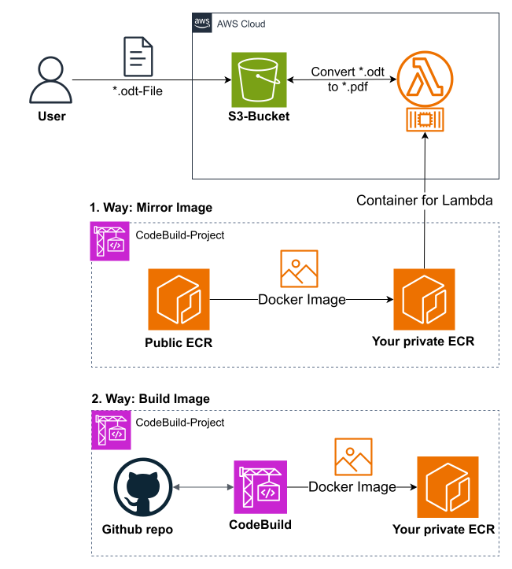

# S3 Bucket PDF-Converter

Using a Lambda function, OpenDocument files (*.odt) are automatically converted into a PDF (*.pdf) when they are uploaded to an S3 bucket.

The Lambda function uses a Docker container in which LibreOffice is installed and which takes over the task of conversion to pdf.

The Docker image was kept very generic so that the PDF converter application can run on both **x86** and **arm64** architecture.

The entire project has been configured in a minimalistic way to operate within the AWS Free Tier limits (as of 2025), potentially avoiding additional AWS costs.

## CDK Python - Demo
`Note: Using the cdk deployment may incur additional costs in AWS due to the use of the necessary AWS resources.`



Unfortunately Lambda functions supports Docker images **only from your private ECR** and not from public container registries.
Therefore, you can choose between two ways to build and deploy the Docker image to your repository:
*   Build and upload your Docker image **locally** from your PC using `simple_stack`.
*   Build and deploy your Docker image from **CodeBuild** in AWS for **x86** or **arm64** architecture.

You have to choose between the x86 or arm64 architecture because:
`Lambda does not support functions that use multi-architecture container images.`
So if you wish to run your Lambda function in x86, you need to create the corresponding x86 Docker image.


The CodePipeline stack creates a new CodePipeline project, grabs the source code directly from this github repository (CodeConnection to github must be available). In the build step we run the Lambda stack on a CodeBuild VM to build and deploy the docker image in a the default cdk repository of ECR. Also the Lambda function and the S3 bucket for the documents are created.

A SQS queue collects succesful odt-to-pdf-conversations, so you can programmatically process when new pdf documents are available. This is also shown in the included test script `test.sh` in the CodeBuild project.

### Requirements

*   AWS CDK installed and the target environment bootstrapped (`cdk bootstrap`).
*   An AWS account connected to your GitHub account via CodeConnections to enable the CodePipeline/CodeBuild project.

### Deployment
The following steps will use the AWS CDK to deploy the cdk app.

1. Clone this repository
```
git clone https://github.com/ronfoerster/s3-pdf-converter.git && \
cd s3-pdf-converter
```
2. This project is set up like a standard Python project. To create the virtualenv it assumes that there is a `python3`
(or `python` for Windows) executable in your path with access to the `venv` package. 
To manually create a virtualenv on MacOS and Linux:

```
$ python3 -m venv .venv
```

After the init process completes and the virtualenv is created, you can use the following
step to activate your virtualenv.

```
$ source .venv/bin/activate
```

If you are a Windows platform, you would activate the virtualenv like this:

```
% .venv\Scripts\activate.bat
```

Once the virtualenv is activated, you can install the required dependencies.

```
$ pip install -r requirements.txt
```

3. Choose your favorite method to build the docker image.
Edit the `cdk.context.json` and set `local` to `True` (default) to build your docker image local on your PC,
or specify the variable directly in the cdk deploy command wit h the parameter `-c local=True`


At this point you can now synthesize the CloudFormation template for this code.

```
$ cdk synth
```

And deploy the CDK app to your AWS environment.
```
$ cdk deploy
```
or with  `-c local=True` for the local simple stack or `-c local=False` for the CodePipeline stack.

### Cleanup
Run
```
$ cdk destroy
```
or remove the stacks manually in the AWS console.